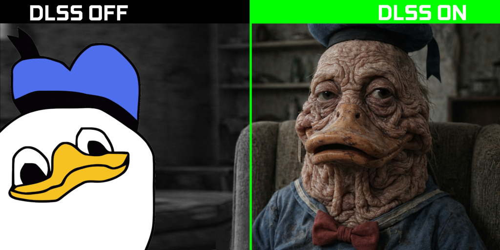

# DLSS Linux Open Proxy for AMD



---

## DISCLAIMER

**This is slop.** Everything here, save for any externally-sourced code<sup>1</sup>,
is AI-generated. The initial implementation was done by GPT 6 Astra running in Ultra
mode after I shitposted into the prompt box.

Please note that I have close to 20 years of experience as a software dev. I
can review AI-generated code perfectly fine. Also note that I haven't read a
single god damned line of code in this repo.

*<sup>1</sup> Most of the externally-sourced code is probably slop, too.*

---

## Description

Experimental Linux source integration of [lmxxf](https://github.com/lmxxf)'s
[AMD neural implementation](https://github.com/lmxxf/dlss5-on-amd-9070xt-porting)
and [bmitch87](https://github.com/bmitch87)'s
[Vulkan presentation layer](https://github.com/bmitch87/DLSS5VKLayer). A native
HIP worker processes a proxy of the game frame; the Vulkan layer composes the
neural edit at the original resolution. The standalone Qt 6 Widgets controller
exposes all 40 settings. Worker, layer, CLI and GUI use shared-memory protocol
**23**.

This repository contains source, patches and build tools. **No compiled binaries
or model weights are included.** See [VALIDATION.md](VALIDATION.md) for automated
tests and hardware testing instructions.

## Prepare a checkout

Clone this repository without recursively checking out its submodules, then run
these commands from the repository root:

```bash
python3 scripts/fetch-submodules.py
python3 scripts/prepare-sources.py
```

The fetch helper uses exact commits, filtered downloads and selected working-tree
paths, avoiding upstream binary payloads. A shallow clone alone does not omit
those files. The helper fails if the server cannot provide blob filtering. The
preparation script verifies the hashes of the pinned inputs and applies
`patches/linux-integration.patch`. It generates `upstream-layer/`, `kernels/` and
`backend/vendor/`; those directories are not tracked in the parent repository.
Run it again after a pull: it updates files it prepared, deletes those the patch
no longer produces and refuses to overwrite local edits.
Pins, file mappings and hashes are in `upstreams.lock.json`; attribution is in
[PROVENANCE.md](PROVENANCE.md).

## Build

The reference workflow is [.github/workflows/build.yml](.github/workflows/build.yml)
on Ubuntu 26.04. Its build dependencies are:

```bash
sudo apt-get update
sudo apt-get install --no-install-recommends \
    ca-certificates git curl build-essential cmake ninja-build \
    python3 python3-numpy python3-pil qt6-base-dev libx11-dev libxi-dev \
    libvulkan-dev mesa-vulkan-drivers vulkan-validationlayers glslang-tools \
    spirv-tools clang-22 lld-22 llvm-22
```

Install DXC 1.9.2607 using the exact download URL and SHA-256 in the workflow.
Set `DXC_DIR` to the extracted directory containing `bin/` and `lib/` (inside
the archive's top-level directory), then build from the prepared checkout:

```bash
python3 scripts/build-kernels.py --compiler clang++-22 --linker /usr/bin/ld.lld-22
cmake -S . -B build -G Ninja -DDXC="$DXC_DIR/bin/dxc" \
    -DPython3_EXECUTABLE=/usr/bin/python3
cmake --build build --parallel 2
ctest --test-dir build --output-on-failure
```

This compiles and validates ten Vulkan shaders, compiles the `gfx1201` HIP modules
(the network's and `linux_native`, the worker's codec, tuning, color and motion
kernels), and builds the worker, layer, CLI, Qt GUI and tests.
CMake builds the shaders from their prepared sources; `-DDXC` defaults to `dxc`
on `PATH`.
Compilation does not require a GPU, ROCm runtime or model weights. Qt uses the
distribution's shared Qt 6 libraries; the worker and layer have no Qt dependency.
For an independent GUI build, see [gui/README.md](gui/README.md).

On a successful push or manual Actions run, CI packages fresh
runtime outputs as `dist/dlsslop-amd-linux-gfx1201.tar.xz` in the
`dlsslop-amd-linux-gfx1201` artifact. The archive contains the installer, compiled
binaries and HIP modules, runtime Python tools, and required notices; it contains
no source tree or model weights. Extract it, enter the extracted directory and
check `sha256sum --check PACKAGE-SHA256SUMS` before installation.
`licenses/SOURCES` identifies the corresponding source revision. Pull-request
runs check the package without uploading it: their merge commit is temporary.

## Install

After building, stop any running game and worker, then install from the
checkout:

```bash
python3 install.py
export PATH="$HOME/.local/bin:$PATH"
```

The same installer handles a source build or an extracted CI archive. It
installs into `~/.local` by default; `install.py --help` describes prefix,
build-directory and manifest overrides. It installs these commands:

| Command | Purpose |
|---|---|
| `dlsslopd` | Native HIP worker |
| `dlsslopctl` | Command-line controller |
| `dlsslop-gui` | Qt controller |
| `dlsslop-test` | Color diagnostic |
| `dlsslop-setup` | Model coefficient importer |
| `dlsslop-run` | Game launcher |

It also installs the release README, [packaging/README.md](packaging/README.md),
as `~/.local/share/doc/dlsslop-amd/README.md`. Check its runtime requirements,
then follow it from "Set up the model" onward to import the model, start a game,
use the controllers and run capture and color checks.
[CONTROL-OPTIONS.md](CONTROL-OPTIONS.md) describes every setting and
[COLOR-PRESERVATION.md](COLOR-PRESERVATION.md) the color correction.

## Source-tree notes

The worker finds HIP modules under `share/dlsslop-amd/HIP/gfx1201` relative to
its executable prefix, with `assets/HIP/gfx1201` as the development fallback.
Set `DLSSLOP_MODULES` or pass `-m` / `--modules` to select another directory.
`--device N` selects a visible compatible HIP device.

The layer retains upstream `DLSSNR_*` environment names. Its shared runtime
fallback is `/tmp/dlssnr-UID/`, with `DLSSNR_UID` overriding that ID; the
native tools select their own default channel independently of `DLSSNR_UID`.
Normal inference never substitutes an identity filter; `dlsslopd
--test-identity` is an explicit transport-test mode. If no valid worker result
arrives, the layer presents the original frame.

When changing prepared upstream sources, use `scripts/update-source-patch.py`
to update the local patch, then review it before committing.
Keep the pins and all license/attribution notices intact.
