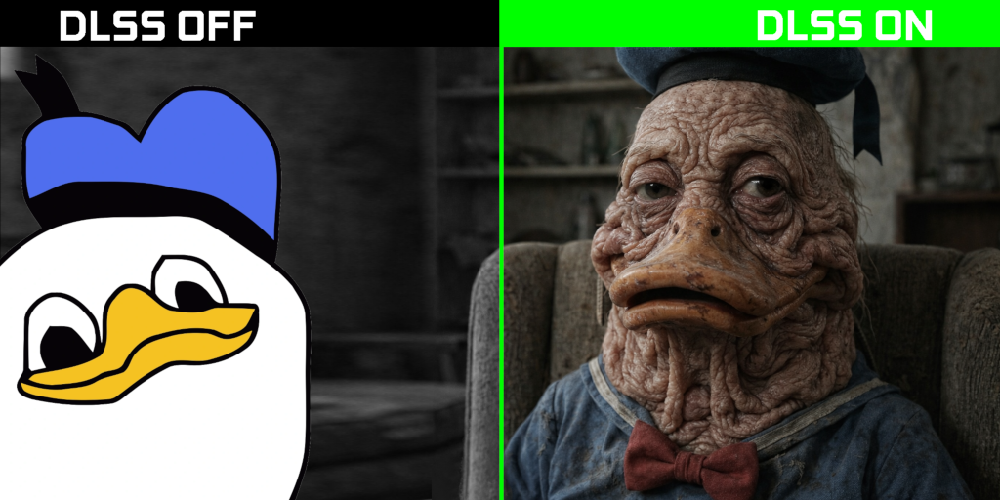

# DLSS Linux Open Proxy for AMD



---

## DISCLAIMER

**This is slop.** Everything here, save for any externally-sourced code<sup>1</sup>,
is AI-generated. The initial implementation was done by GPT 6 Astra running in Ultra
mode after I shitposted into the prompt box.

Please note that I have close to 20 years of experience as a software dev. I
can review AI-generated code perfectly fine. Also note that I haven't read a
single god damned line of code in this repo.

*<sup>1</sup> Most of the externally-sourced code is probably slop, too.*

---

## Description

Experimental Linux source integration of [mochizuki0323](https://github.com/mochizuki0323)'s
[Vulkan neural implementation](https://github.com/mochizuki0323/DLSSNR-AMD),
[lmxxf](https://github.com/lmxxf)'s
[HIP neural implementation](https://github.com/lmxxf/dlss5-on-amd-9070xt-porting)
and [bmitch87](https://github.com/bmitch87)'s
[Vulkan presentation layer](https://github.com/bmitch87/DLSS5VKLayer). A native
daemon runs the network on a proxy of the game frame, on a Vulkan device of its
own or, as the alternative, with HIP; the Vulkan layer composes the neural edit
at the original resolution. Experimentally, the layer runs the Vulkan network
itself, on the game's own device (`dlsslop-run --layer-network`). The
standalone Qt 6 Widgets controller exposes all 41 settings. Worker, layer, CLI
and GUI use shared-memory protocol **28**.

This repository contains source and build tools. **No compiled binaries
or model weights are included.** See [VALIDATION.md](VALIDATION.md) for automated
tests and hardware testing instructions.

## Prepare a checkout

Clone this repository without recursively checking out its submodules, then run
these commands from the repository root:

```bash
python3 scripts/fetch-submodules.py
```

The fetch helper uses exact commits, filtered downloads and selected working-tree
paths, avoiding upstream binary payloads. A shallow clone alone does not omit
those files. The helper fails if the server cannot provide blob filtering.
The layer, the Vulkan network's shaders and model extractor, and the HIP
network's kernels come from dlsslop-amd's forks of their upstreams, whose
`dlsslop-amd` branches carry the Linux integration; the build reads the fetched
sources in place under `external/`. Both networks run with the project's own
host code.
A checkout prepared before the forks needs `git submodule sync` once, so that
the fetch uses the forks, and the generated `upstream-layer/`, `kernels/`,
`backend/vendor/`, `vulkan-nr/` and `.prepared-sources.json` can be deleted.
The OptiScaler submodule is gone too: `external/optiscaler/` and
`.git/modules/optiscaler/` can be deleted, and
`git config --remove-section submodule.optiscaler` removes its settings.
Pins and fetched paths are in `upstreams.lock.json`; attribution is in
[PROVENANCE.md](PROVENANCE.md).

## Build

The reference workflow is [.github/workflows/build.yml](.github/workflows/build.yml)
on Ubuntu 26.04. Its build dependencies are:

```bash
sudo apt-get update
sudo apt-get install --no-install-recommends \
    ca-certificates git build-essential cmake ninja-build \
    python3 python3-numpy python3-pil qt6-base-dev libx11-dev libxi-dev \
    libvulkan-dev mesa-vulkan-drivers vulkan-validationlayers glslang-tools \
    spirv-tools clang-22 lld-22 llvm-22
```

Then build from the fetched checkout:

```bash
python3 scripts/build-kernels.py --compiler clang++-22 --linker /usr/bin/ld.lld-22
cmake -S . -B build -G Ninja -DPython3_EXECUTABLE=/usr/bin/python3
cmake --build build --parallel 2
ctest --test-dir build --output-on-failure
```

This compiles and validates ten Vulkan shaders, compiles the Vulkan network's
SPIR-V with `glslang` and the `gfx1201` HIP modules (the HIP network's and
`linux_native`, its codec, tuning, color and motion kernels), and builds the
daemon, layer, CLI, Qt GUI and tests.
CMake compiles the layer's shaders, the composition shader in `layer/dlssnr/`
and the scaling filters in `layer/scaling/`, with glslang.
Compilation does not require a GPU, ROCm runtime or model weights. Qt uses the
distribution's shared Qt 6 libraries; the worker and layer have no Qt dependency.
For an independent GUI build, see [gui/README.md](gui/README.md).

On a successful push or manual Actions run, CI packages fresh runtime outputs
and uploads the archive itself as the `dlsslop-amd-linux-gfx1201.tar.xz`
artifact. Its root is an installation prefix (`bin/`, `lib/`, `libexec/`,
`share/`) holding the compiled binaries and HIP modules, runtime Python tools,
the Vulkan layer manifest and required notices, stamped with the packaging time;
it contains no source tree or model weights. `share/doc/dlsslop-amd/SHA256SUMS`
lists every other file relative to that root, and `share/doc/dlsslop-amd/licenses/SOURCES`
identifies the corresponding source revision. Pull-request runs check the package
without uploading it: their merge commit is temporary.

## Install

After building, stop any running game and worker, then install from the
checkout:

```bash
python3 install.py
export PATH="$HOME/.local/bin:$PATH"
```

The installer lays a source build out exactly like the binary release (see
[packaging/README.md](packaging/README.md)), in `~/.local` by default;
`install.py --help` describes the prefix and build-directory options. It
installs these commands:

| Command | Purpose |
|---|---|
| `dlsslopd` | Neural rendering daemon (Vulkan or HIP) |
| `dlsslopctl` | Command-line controller |
| `dlsslop-gui` | Qt controller |
| `dlsslop-test` | Color diagnostic |
| `dlsslop-setup` | Model extractor and importer |
| `dlsslop-run` | Game launcher |

It also installs the release README, [packaging/README.md](packaging/README.md),
as `~/.local/share/doc/dlsslop-amd/README.md`. Check its runtime requirements,
then follow it from "Set up the model" onward to import the model, start a game,
use the controllers and run capture and color checks.
[CONTROL-OPTIONS.md](CONTROL-OPTIONS.md) describes every setting and
[COLOR-PRESERVATION.md](COLOR-PRESERVATION.md) the color correction.

## Source-tree notes

The daemon finds the Vulkan network's SPIR-V under `share/dlsslop-amd/vulkan`
relative to its executable prefix, with `vulkan-nr/network` beside the executable
as the source build's. It finds HIP modules under `share/dlsslop-amd/HIP/gfx1201`,
with `assets/HIP/gfx1201` as the development fallback.
Set `DLSSLOP_MODULES` or pass `-m` / `--modules` to select another directory.
`--device N` selects a compatible device by its index: HIP's, or with the Vulkan
backend the physical device's.

The layer retains upstream `DLSSNR_*` environment names. Its shared runtime
fallback is `/tmp/dlssnr-UID/`, with `DLSSNR_UID` overriding that ID; the
native tools select their own default channel independently of `DLSSNR_UID`.
Normal inference never substitutes an identity filter; `dlsslopd
--test-identity` is an explicit transport-test mode. If no valid worker result
arrives, the layer presents the original frame.

Changes to upstream sources are commits on a fork's `dlsslop-amd` branch; pin
the new commit in the submodule and in `upstreams.lock.json`.
Keep the pins and all license/attribution notices intact.
